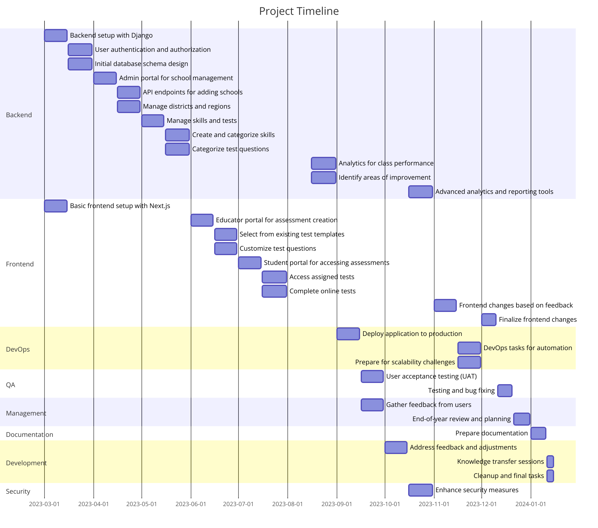
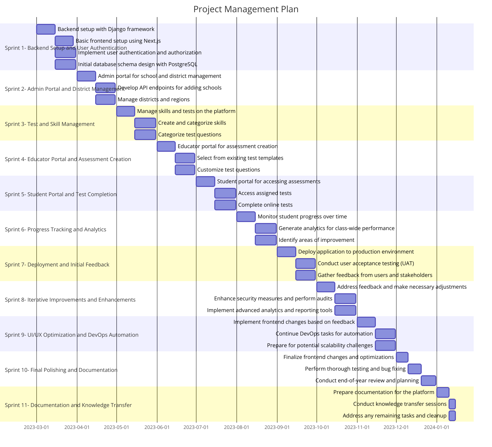

# Project Management
## Mind Map

## Project Plan

### Sprint 1: Backend Setup and User Authentication (Mar 1 - Mar 31)

| **User Story**                                     | **Story Points** | **Assigned To** | **Due Date** |
|----------------------------------------------------|------------------|-----------------|--------------|
| Backend setup with Django framework                | 5                | Backend Team    | Mar 15       |
| Basic frontend setup using Next.js                 | 5                | Frontend Team   | Mar 15       |
| Implement user authentication and authorization   | 8                | Backend Team    | Mar 31       |
| Initial database schema design with PostgreSQL    | 7                | Backend Team    | Mar 31       |

**User Story Details:**
1. **Backend setup with Django framework:** Set up the backend infrastructure using Django framework to lay the foundation for the application's core functionalities. Ensure proper configuration of Django with necessary packages.
   
2. **Basic frontend setup using Next.js:** Create a basic frontend structure using Next.js framework. Set up routing and basic UI components to establish the structure for the user interfaces.
   
3. **Implement user authentication and authorization:** Develop user authentication and authorization mechanisms using JWT to ensure secure access to different parts of the application based on user roles (admin, educator, student).
   
4. **Initial database schema design with PostgreSQL:** Design the initial database schema using PostgreSQL to define the structure of data storage. Establish relationships between different entities such as users, schools, districts, tests, and skills.

*Note: This sprint focuses on laying the foundation of the application by setting up the backend infrastructure, implementing user authentication, and designing the initial database schema. This will provide a robust basis for future development.*

---

### Sprint 2: Admin Portal and District Management (Apr 1 - Apr 30)

| **User Story**                               | **Story Points** | **Assigned To** | **Due Date** |
|----------------------------------------------|------------------|-----------------|--------------|
| Admin portal for school and district management | 8               | Backend Team    | Apr 15       |
| Develop API endpoints for adding schools     | 6                | Backend Team    | Apr 30       |
| Manage districts and regions                 | 7                | Backend Team    | Apr 30       |

**User Story Details:**
1. **Admin portal for school and district management:** Create an admin portal interface for managing schools, districts, and regions. Allow RCAT main admins to add, edit, and delete schools, whitelist domains, and organize districts and regions efficiently.
   
2. **Develop API endpoints for adding schools:** Implement API endpoints to facilitate the addition of new schools to the platform. Ensure proper validation and authentication mechanisms for adding schools securely.
   
3. **Manage districts and regions:** Develop functionalities to manage districts and regions within the admin portal. Allow RCAT main admins to create, edit, and organize districts and regions according to geographical or administrative boundaries.

*Note: This sprint focuses on building the admin portal and necessary backend functionalities for managing schools, districts, and regions. These features are crucial for efficient platform administration.*

---

### Sprint 3: Test and Skill Management (May 1 - May 31)

| **User Story**                               | **Story Points** | **Assigned To** | **Due Date** |
|----------------------------------------------|------------------|-----------------|--------------|
| Manage skills and tests on the platform      | 8                | Backend Team    | May 15       |
| Create and categorize skills                 | 6                | Backend Team    | May 31       |
| Categorize test questions                    | 7                | Backend Team    | May 31       |

**User Story Details:**
1. **Manage skills and tests on the platform:** Develop functionalities to manage skills and tests available on the platform. Allow RCAT main admins to add, edit, or remove skills and categories related to reading comprehension and vocabulary.
   
2. **Create and categorize skills:** Implement features to add and categorize skills within the platform. Allow admins to create new skills and categorize them based on educational standards and requirements.
   
3. **Categorize test questions:** Develop functionalities to categorize test questions by genre (e.g., informational, narrative) to facilitate targeted assessments. Allow admins to categorize questions within tests for better organization and assessment.

*Note: This sprint focuses on enhancing the platform's capabilities for managing skills and tests, which are essential for providing relevant and effective assessments to users.*

---

### Sprint 4: Educator Portal and Assessment Creation (Jun 1 - Jun 30)

| **User Story**                               | **Story Points** | **Assigned To** | **Due Date** |
|----------------------------------------------|------------------|-----------------|--------------|
| Educator portal for assessment creation      | 8                | Frontend Team   | Jun 15       |
| Select from existing test templates         | 6                | Frontend Team   | Jun 30       |
| Customize test questions                     | 7                | Frontend Team   | Jun 30       |

**User Story Details:**
1. **Educator portal for assessment creation:** Develop the educator portal interface for creating assessments. Allow educators to select from existing test templates, customize questions, and assign tests to students.
   
2. **Select from existing test templates:** Implement features for educators to select from a pool of existing test templates when creating assessments. Provide options for filtering and searching templates based on various criteria.
   
3. **Customize test questions:** Develop functionalities to customize test questions within assessments. Allow educators to add, remove, or modify questions to tailor assessments to their classroom needs.

*Note: This sprint focuses on empowering educators with tools for creating and customizing assessments, enhancing their ability to evaluate student progress effectively.*

---

### Sprint 5: Student Portal and Test Completion (Jul 1 - Jul 31)

| **User Story**                               | **Story Points** | **Assigned To** | **Due Date** |
|----------------------------------------------|------------------|-----------------|--------------|
| Student portal for accessing assessments      | 8                | Frontend Team   | Jul 15       |
| Access assigned tests                        | 6                | Frontend Team   | Jul 31       |
| Complete online tests                        | 7                | Frontend Team   | Jul 31       |

**User Story Details:**
1. **Student portal for accessing assessments:** Develop the student portal interface for accessing assigned assessments. Provide a user-friendly interface for students to view due dates, instructions, and access assessments.
   
2. **Access assigned tests:** Implement features for students to easily find and access assigned tests within their portal. Ensure clear navigation and intuitive user experience for accessing assessments.
   
3. **Complete online tests:** Develop functionalities for students to complete online tests within the platform. Provide tools such as a math editor for solving relevant problems and ensure immediate feedback upon completion.

*Note: This sprint focuses on enhancing the student experience by providing a dedicated portal for accessing and completing assessments efficiently.*

---

### Sprint 6: Progress Tracking and Analytics (Aug 1 - Aug 31)

| **User Story**                               | **Story Points** | **Assigned To** | **Due Date** |
|----------------------------------------------|------------------|-----------------|--------------|
| Monitor student progress over time           | 8                | Backend Team    | Aug 15       |
| Generate analytics for class-wide performance| 7                | Backend Team    | Aug 31       |
| Identify areas of improvement               | 6                | Backend Team    | Aug 31       |

**User Story Details:**
1. **Monitor student progress over time:** Develop functionalities to monitor student progress and performance on assessments over time. Provide educators with insights into learning trends and areas for improvement.
   
2. **Generate analytics for class-wide performance:** Implement features to generate analytics and reports on class-wide performance trends. Provide visualizations and insights to educators for better understanding of class performance.
   
3. **Identify areas of improvement:** Develop tools to identify areas of improvement and strengths based on student performance data. Provide educators with actionable insights for personalized feedback and support.

*Note: This sprint focuses on providing educators with robust tools for tracking student progress and performance, enabling them to make data-driven decisions to enhance teaching and learning.*

---

### Sprint 7: Deployment and Initial Feedback (Sep 1 - Sep 30)

| **User Story**                               | **Story Points** | **Assigned To** | **Due Date** |
|----------------------------------------------|------------------|-----------------|--------------|
| Deploy application to production environment | 8                | DevOps Team     | Sep 15       |
| Conduct user acceptance testing (UAT)       | 7                | QA Team         | Sep 30       |
| Gather feedback from users and stakeholders  | 6                | Product Manager | Sep 30       |

**User Story Details:**
1. **Deploy application to production environment:** Deploy the RCAT application to the production environment on AWS or Vercel. Ensure proper configuration and optimization for scalability and performance.
   
2. **Conduct user acceptance testing (UAT):** Conduct thorough testing of the deployed application to validate functionality and user experience. Engage users and stakeholders to perform acceptance testing and gather feedback.
   
3. **Gather feedback from users and stakeholders:** Collect feedback from users and stakeholders regarding their experience with the platform. Analyze feedback to identify areas for improvement and prioritize enhancements.

*Note: This sprint focuses on deploying the application to production, conducting user acceptance testing, and gathering feedback to iteratively improve the platform based on user input.*

---

### Sprint 8: Iterative Improvements and Enhancements (Oct 1 - Oct 31)

| **User Story**                               | **Story Points** | **Assigned To** | **Due Date** |
|----------------------------------------------|------------------|-----------------|--------------|
| Address feedback and make necessary adjustments | 8              | Development Team| Oct 15       |
| Enhance security measures and perform audits | 7                | Security Team   | Oct 31       |
| Implement advanced analytics and reporting tools | 6             | Backend Team    | Oct 31       |

**User Story Details:**
1. **Address feedback and make necessary adjustments:** Review user feedback collected during the previous sprint and prioritize necessary adjustments and improvements. Make iterative changes to enhance user experience and address reported issues.
   
2. **Enhance security measures and perform audits:** Strengthen security measures within the application and perform security audits to identify potential vulnerabilities. Ensure compliance with privacy regulations and best practices.
   
3. **Implement advanced analytics and reporting tools:** Develop and integrate advanced analytics and reporting tools into the platform. Provide educators with enhanced insights and data visualization capabilities for informed decision-making.

*Note: This sprint focuses on iterative improvements based on user feedback, strengthening security measures, and introducing advanced analytics capabilities to further enhance the platform's functionality.*

---

### Sprint 9: UI/UX Optimization and DevOps Automation (Nov 1 - Nov 30)

| **User Story**                               | **Story Points** | **Assigned To** | **Due Date** |
|----------------------------------------------|------------------|-----------------|--------------|
| Implement frontend changes based on feedback | 8                | Frontend Team   | Nov 15       |
| Continue DevOps tasks for automation        | 7                | DevOps Team     | Nov 30       |
| Prepare for potential scalability challenges| 6                | DevOps Team     | Nov 30       |

**User Story Details:**
1. **Implement frontend changes based on feedback:** Incorporate frontend changes and optimizations based on user feedback and usability testing results. Enhance UI/UX elements to improve user satisfaction and engagement.
   
2. **Continue DevOps tasks for automation:** Automate deployment and operational tasks using CI/CD pipelines and infrastructure as code (IaC) principles. Ensure smooth and efficient deployment processes for ongoing development and updates.
   
3. **Prepare for potential scalability challenges:** Assess the platform's scalability requirements and prepare necessary infrastructure and configurations to handle potential scalability challenges. Optimize resource allocation and performance for anticipated growth.

*Note: This sprint focuses on optimizing the user interface and experience based on feedback, automating DevOps tasks for efficiency, and preparing the platform for scalability to accommodate future growth.*

---

### Sprint 10: Final Polishing and Documentation (Dec 1 - Dec 31)

| **User Story**                               | **Story Points** | **Assigned To** | **Due Date** |
|----------------------------------------------|------------------|-----------------|--------------|
| Finalize frontend changes and optimizations | 8                | Frontend Team   | Dec 10       |
| Perform thorough testing and bug fixing     | 7                | QA Team         | Dec 20       |
| Conduct end-of-year review and planning     | 6                | Product Manager | Dec 31       |

**User Story Details:**
1. **Finalize frontend changes and optimizations:** Complete any remaining frontend changes and optimizations based on feedback and usability testing. Ensure consistency in design elements and smooth user interactions.
   
2. **Perform thorough testing and bug fixing:** Conduct comprehensive testing of the entire platform to identify and resolve any remaining bugs or issues. Ensure the stability and reliability of the application before the end of the year.
   
3. **Conduct end-of-year review and planning:** Review the progress and achievements of the year, gather feedback from the team, and plan for future iterations and enhancements. Identify areas for improvement and set goals for the upcoming year.

*Note: This sprint focuses on putting the final touches on the platform, ensuring it is polished and ready for use. It also involves reflecting on the year's accomplishments and planning for future development.*

---

### Sprint 11: Documentation and Knowledge Transfer (Jan 1 - Jan 15, Following Year)

| **User Story**                               | **Story Points** | **Assigned To** | **Due Date** |
|----------------------------------------------|------------------|-----------------|--------------|
| Prepare documentation for the platform      | 8                | Documentation Team| Jan 10      |
| Conduct knowledge transfer sessions         | 7                | Development Team| Jan 15       |
| Address any remaining tasks and cleanup     | 6                | Development Team| Jan 15       |

**User Story Details:**
1. **Prepare documentation for the platform:** Create comprehensive documentation covering installation, configuration, usage guides, and API references for the RCAT platform. Ensure documentation is clear, organized, and accessible to all stakeholders.
   
2. **Conduct knowledge transfer sessions:** Facilitate knowledge transfer sessions to ensure the smooth handover of the project to relevant stakeholders, including operations, support, and maintenance teams. Share insights, best practices, and key learnings from the project.
   
3. **Address any remaining tasks and cleanup:** Finalize any remaining tasks, perform code cleanup, and ensure all loose ends are tied up before concluding the project. Prepare the platform for handover and maintenance by resolving any outstanding issues.

*Note: This sprint focuses on wrapping up the project by documenting key information and transferring knowledge to relevant teams. It ensures a smooth transition and sets the stage for ongoing support and maintenance.*

---

**Project Name:** RCAT Migration to Django and Next.js  
**Duration:** March 1st - December 31st

---

### Sprint Overview:

| **Sprint**                                      | **Overall Story Points** |
|-------------------------------------------------|--------------------------|
| Sprint 1: Backend Setup and User Authentication| 25                       |
| Sprint 2: Admin Portal and District Management | 21                       |
| Sprint 3: Test and Skill Management             | 21                       |
| Sprint 4: Educator Portal and Assessment Creation | 21                     |
| Sprint 5: Student Portal and Test Completion    | 21                       |
| Sprint 6: Progress Tracking and Analytics      | 21                       |
| Sprint 7: Deployment and Initial Feedback      | 21                       |
| Sprint 8: Iterative Improvements and Enhancements | 21                    |
| Sprint 9: UI/UX Optimization and DevOps Automation | 21                    |
| Sprint 10: Final Polishing and Documentation   | 21                       |
| Sprint 11: Documentation and Knowledge Transfer| 21                       |

---

### Sprint Details:

### Sprint 1: Backend Setup and User Authentication
- Initial backend setup using Django framework.
- Implementation of user authentication and authorization.
- Designing the initial database schema with PostgreSQL.
- **Total Story Points:** 25

### Sprint 2: Admin Portal and District Management
- Development of the admin portal for school and district management.
- Creation of API endpoints for adding schools and managing districts.
- Implementation of functionalities for managing districts and regions.
- **Total Story Points:** 21

### Sprint 3: Test and Skill Management
- Management of skills and tests on the platform.
- Creation and categorization of skills.
- Categorization of test questions.
- **Total Story Points:** 21

### Sprint 4: Educator Portal and Assessment Creation
- Development of the educator portal for assessment creation.
- Implementation of features for selecting test templates and customizing test questions.
- **Total Story Points:** 21

### Sprint 5: Student Portal and Test Completion
- Creation of the student portal for accessing and completing assessments.
- Implementation of functionalities for accessing assigned tests and completing online tests.
- **Total Story Points:** 21

### Sprint 6: Progress Tracking and Analytics
- Development of functionalities for monitoring student progress over time.
- Generation of analytics for class-wide performance.
- Identification of areas of improvement.
- **Total Story Points:** 21

### Sprint 7: Deployment and Initial Feedback
- Deployment of the application to the production environment.
- Conducting user acceptance testing (UAT).
- Gathering feedback from users and stakeholders.
- **Total Story Points:** 21

### Sprint 8: Iterative Improvements and Enhancements
- Addressing feedback and making necessary adjustments.
- Enhancing security measures and performing audits.
- Implementing advanced analytics and reporting tools.
- **Total Story Points:** 21

### Sprint 9: UI/UX Optimization and DevOps Automation
- Implementing frontend changes based on feedback.
- Continuing DevOps tasks for automation.
- Preparing for potential scalability challenges.
- **Total Story Points:** 21

### Sprint 10: Final Polishing and Documentation
- Finalizing frontend changes and optimizations.
- Performing thorough testing and bug fixing.
- Conducting end-of-year review and planning.
- **Total Story Points:** 21

### Sprint 11: Documentation and Knowledge Transfer
- Preparing documentation for the platform.
- Conducting knowledge transfer sessions.
- Addressing any remaining tasks and cleanup.
- **Total Story Points:** 21

---

### Total Estimated Development Hours per Sprint:

#### Sprint 1: Backend Setup and User Authentication
- Total Estimated Hours: 260

#### Sprint 2: Admin Portal and District Management
- Total Estimated Hours: 210

#### Sprint 3: Test and Skill Management
- Total Estimated Hours: 210

#### Sprint 4: Educator Portal and Assessment Creation
- Total Estimated Hours: 210

#### Sprint 5: Student Portal and Test Completion
- Total Estimated Hours: 210

#### Sprint 6: Progress Tracking and Analytics
- Total Estimated Hours: 210

#### Sprint 7: Deployment and Initial Feedback
- Total Estimated Hours: 210

#### Sprint 8: Iterative Improvements and Enhancements
- Total Estimated Hours: 210

#### Sprint 9: UI/UX Optimization and DevOps Automation
- Total Estimated Hours: 210

#### Sprint 10: Final Polishing and Documentation
- Total Estimated Hours: 210

#### Sprint 11: Documentation and Knowledge Transfer
- Total Estimated Hours: 147

**Grand Total Estimated Development Hours: 2427**

---
 
## Milestone 1: July Completion

### Date: July 31st

### Objective:
Successfully launch the foundational aspects of the RCAT platform, including the backend setup, admin portal, educator and student portals, along with the capabilities for assessment creation and test completion.

### Key Deliverables:
1. Backend infrastructure and initial database schema.
2. Admin portal for school and district management.
3. Test and skill management functionalities.
4. Educator portal for assessment creation.
5. Student portal for accessing and completing assessments.

### Sprints Included:
- **Sprint 1:** Backend Setup and User Authentication
- **Sprint 2:** Admin Portal and District Management
- **Sprint 3:** Test and Skill Management
- **Sprint 4:** Educator Portal and Assessment Creation
- **Sprint 5:** Student Portal and Test Completion

### Total Estimated Development Hours: 1050 Hours

---

## Milestone 2: November Completion

### Date: November 30th

### Objective:
Enhance the RCAT platform with advanced functionalities including progress tracking, analytics, deployment, iterative improvements, UI/UX optimization, and DevOps automation to ensure a robust, scalable, and user-friendly application.

### Key Deliverables:
1. Progress tracking and analytics for educators.
2. Deployment of the application to the production environment.
3. Iterative improvements based on initial feedback.
4. UI/UX optimization based on user feedback.
5. DevOps automation for efficient deployment and scalability.

### Sprints Included:
- **Sprint 6:** Progress Tracking and Analytics
- **Sprint 7:** Deployment and Initial Feedback
- **Sprint 8:** Iterative Improvements and Enhancements
- **Sprint 9:** UI/UX Optimization and DevOps Automation

### Total Estimated Development Hours: 840 Hours

---

**Note:** Following the November milestone, the project will enter its final phase focused on polishing, documentation, and knowledge transfer to ensure a smooth handover and prepare for future enhancements.

---
To accommodate the need for a frontend developer during the frontend development phase, we can adjust the project plan by including a section for requesting additional resources. This section will highlight the necessity for additional frontend development support for two months, emphasizing the importance of this role in achieving the project milestones effectively. Let's add this section right before the **Project Milestone Document** to ensure it's considered in the resource planning and allocation process.

---

### Additional Resource Request

#### Request for Frontend Developer Assistance

**Name:** Software Team  
**Request:** Due to the comprehensive scope of frontend development tasks outlined in the project plan, an additional frontend developer is required to support the project for a duration of two months. This support is specifically needed during the months dedicated to the development of the Educator Portal and Assessment Creation (Sprint 4: Jun 1 - Jun 30) and the Student Portal and Test Completion (Sprint 5: Jul 1 - Jul 31).

**Justification:** The complexity and volume of frontend tasks during these sprints necessitate expert assistance to ensure the timely and quality completion of deliverables. The additional frontend developer will contribute to:

- Developing and refining the user interfaces for the Educator and Student Portals.
- Implementing interactive and user-friendly features for assessment creation, test customization, and test completion.
- Ensuring the application's responsiveness and accessibility across different devices and platforms.

**Outcome:** Securing an additional frontend developer for this period will significantly enhance our team's capability to deliver a high-quality, user-centric frontend. This will not only ensure that the project remains on schedule but will also contribute to an engaging and efficient user experience, ultimately supporting the project's success.

---
