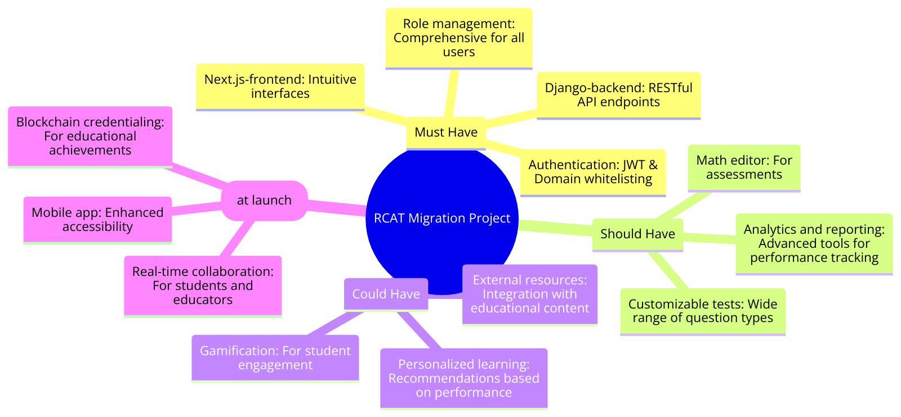

# Project Management
## Mind Map

## Project Plan

### Sprint 1: High-Fidelity Prototype Creation

_Due: March 1st_

#### Tasks

| **Task**                                      | **Related US**                        | **Assigned To** | **Due Date** |
| --------------------------------------------- | ------------------------------------- | --------------- | ------------ |
| Create high-fidelity prototype for Admin UI   | School and District Management        | UI/UX Team      | Mar 1        |
| Create high-fidelity prototype for Educator UI| Assessment Creation and Distribution  | UI/UX Team      | Mar 1        |
| Create high-fidelity prototype for Student UI | Accessing and Completing Assessments  | UI/UX Team      | Mar 1        |
| Review and finalize prototype with stakeholders| N/A                                   | Project Manager | Mar 1        |

### Sprint 2: Backend Setup and Initial Development

_Due: April 15th_

#### Tasks

| **Task**                                      | **Related US**                        | **Assigned To** | **Due Date** |
| --------------------------------------------- | ------------------------------------- | --------------- | ------------ |
| Setup Django backend environment              | N/A                                   | Backend Team    | Mar 15       |
| Define RESTful API endpoints                  | All Must Have Features                | Backend Team    | Apr 1        |
| Implement JWT authentication                  | Secure authentication and authorization | Backend Team  | Apr 15       |

### Sprint 3: Frontend Setup and Initial Development

_Due: May 15th_

#### Tasks

| **Task**                                      | **Related US**                        | **Assigned To** | **Due Date** |
| --------------------------------------------- | ------------------------------------- | --------------- | ------------ |
| Setup Next.js frontend environment            | N/A                                   | Frontend Team   | Apr 30       |
| Implement Admin UI based on high-fidelity prototype | School and District Management   | Frontend Team   | May 15       |

### Sprint 4: Core Features Development

_Due: June 15th_

#### Tasks

| **Task**                                      | **Related US**                        | **Assigned To** | **Due Date** |
| --------------------------------------------- | ------------------------------------- | --------------- | ------------ |
| Develop Educator Portal features              | Assessment Creation and Distribution, Student Progress Monitoring | Frontend & Backend Teams | Jun 15 |
| Develop Student Portal features               | Accessing and Completing Assessments, Tracking Learning Progress | Frontend & Backend Teams | Jun 15 |

### Sprint 5: Testing, Feedback, and Refinements

_Due: July 15th_

#### Tasks

| **Task**                                      | **Related US**                        | **Assigned To** | **Due Date** |
| --------------------------------------------- | ------------------------------------- | --------------- | ------------ |
| Conduct User Testing and Gather Feedback      | All Features                          | QA Team         | Jun 30       |
| Implement Feedback and Make Refinements       | N/A                                   | Dev Teams       | Jul 15       |

### Sprint 6: Deployment and Final Testing

_Due: July 30th_

#### Tasks

| **Task**                                      | **Related US**                        | **Assigned To** | **Due Date** |
| --------------------------------------------- | ------------------------------------- | --------------- | ------------ |
| Prepare Deployment on Cloud Hosting           | N/A                                   | DevOps Team     | Jul 20       |
| Final Testing and Bug Fixes                   | N/A                                   | QA Team         | Jul 25       |
| Launch                                         | N/A                                   | Project Manager | Jul 30       |

Understood. Let's break down the project into more detailed sprints that include user stories and story points, similar to the format you've shown:

## Project Plan with User Stories

### Sprint 1: High-Fidelity Prototype Creation (Feb 26 - Mar 1)

#### User stories

| **User story**                               | **Story points** |
| -------------------------------------------- | ---------------- |
| High-fidelity prototype for Admin Portal     | 8                |
| High-fidelity prototype for Educator Portal  | 8                |
| High-fidelity prototype for Student Portal   | 8                |

### Sprint 2: Backend Setup and Core API Development (Mar 2 - Apr 15)

#### User stories

| **User story**                               | **Story points** |
| -------------------------------------------- | ---------------- |
| Setup Django backend environment             | 3                |
| Implement JWT authentication                 | 5                |
| RESTful API for school and district management | 8              |
| RESTful API for test and skill management    | 8                |

### Sprint 3: Frontend Development and Integration (Apr 16 - May 31)

#### User stories

| **User story**                               | **Story points** |
| -------------------------------------------- | ---------------- |
| Setup Next.js frontend environment           | 3                |
| Develop Admin UI for managing schools and districts | 13         |
| Develop Admin UI for test and skill management | 13             |
| Implement frontend for Educator assessment creation and distribution | 13 |
| Implement frontend for Student assessment completion | 13          |

### Sprint 4: Advanced Features and Analytics (Jun 1 - Jul 15)

#### User stories

| **User story**                               | **Story points** |
| -------------------------------------------- | ---------------- |
| Advanced analytics for student progress      | 8                |
| Math editor integration                      | 5                |
| Customizable test creation tools             | 8                |

### Sprint 5: Testing, Feedback, and Deployment (Jul 16 - Jul 30)

#### User stories

| **User story**                               | **Story points** |
| -------------------------------------------- | ---------------- |
| Conduct User Testing and gather feedback     | 5                |
| Implement feedback and refinements           | 8                |
| Prepare and execute deployment               | 5                |

### Estimated Sprint Velocities

- **Sprint 1**: Estimated velocity = 24 story points
- **Sprint 2**: Estimated velocity = 24 story points
- **Sprint 3**: Estimated velocity = 42 story points
- **Sprint 4**: Estimated velocity = 21 story points
- **Sprint 5**: Estimated velocity = 18 story points

