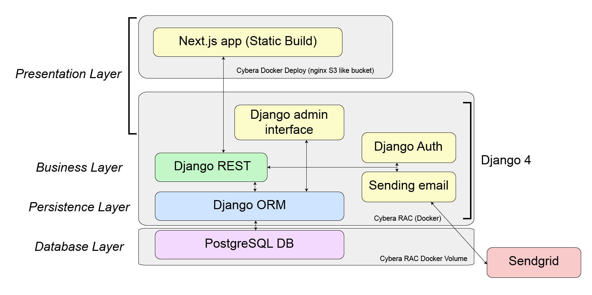
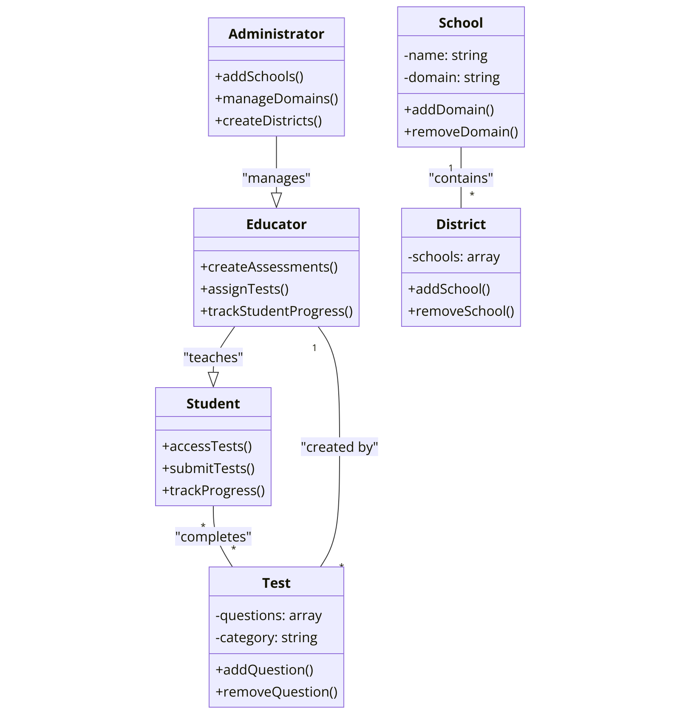
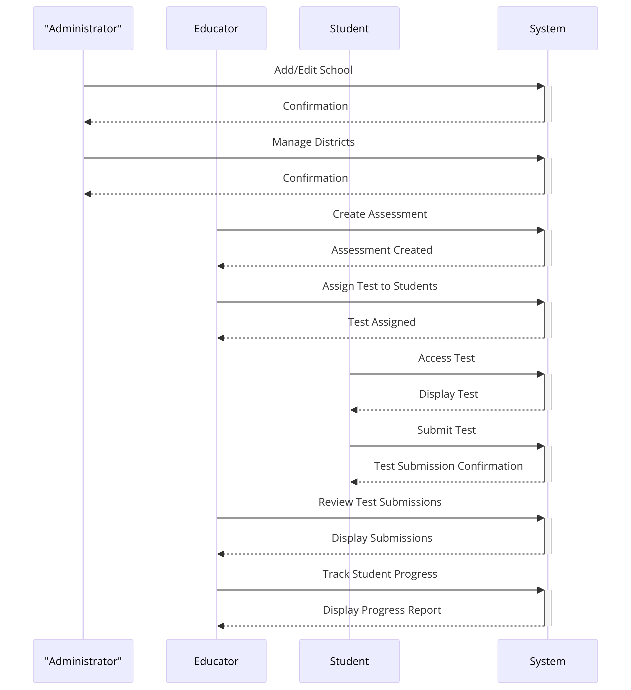

# Software Design

This page includes a short description of the overall architecture style of the system, its high-level system components, and their logical (what data they exchange) and control (how they invoke each other) dependencies. Mostly described using diagrams.

## Architecture Diagram

A NextJS-Django stack built on Docker and hosted on Cybera. The frontend will be statically built, the django server will be running on a separate container. The server will be running the business and persistence layers. The DB is postgres and will be a docker volume attached to the Django container. In addition emails will be sent through [Sendgrid](https://sendgrid.com/). The frontend will communicate with the backend using REST in JSON (header + body) format. 

## UML Class Diagram

## Sequence Diagrams

##  Mind Diagram

## High-Fidelity User interface

]()

## Technology List

### Backend Development
#### Django
High level Python web framework: https://www.djangoproject.com/

- **Authentication**: Django Rest Framework SimpleJWT
  - [DRF SimpleJWT Documentation](https://django-rest-framework-simplejwt.readthedocs.io/en/latest/)

#### djoser
Provides a set of Django Rest Framework views to handle basic authentication actions: https://pypi.org/project/djoser/

#### Sendgrid
Email delivery platform: https://sendgrid.com/

#### Swagger
Provides tools for api documentation: https://swagger.io/

***

### Database
#### SQLite
Lightweight database that is suitable for development: https://www.sqlite.org/index.html

#### PostgreSQL
Powerful, open source object-relational database system, suitable for production: https://www.postgresql.org/

***
 
### Frontend Development
- **Framework**: Next.js
  - [Next.js Documentation](https://nextjs.org/docs)
- **State Management**: Redux or Context API
  - [Redux Documentation](https://redux.js.org/introduction/getting-started)
  - [React Context Documentation](https://reactjs.org/docs/context.html)
- **Styling**: Tailwind CSS or Styled-Components
  - [Tailwind CSS Documentation](https://tailwindcss.com/docs)
  - [Styled-Components Documentation](https://styled-components.com/docs)
#### Jest
Jest is a testing framework for the frontend: https://jestjs.io/

#### Cypress
Cypress is an e2e testing framework: https://www.cypress.io/

***

### Deployment and Operations

- **Cloud Hosting**: AWS or Vercel
  - [AWS Documentation](https://aws.amazon.com/documentation/)
  - [Vercel Documentation](https://vercel.com/docs)
- **CI/CD**: GitHub Actions
  - [GitHub Actions Documentation](https://docs.github.com/en/actions)

***

### DevOps
#### Docker
Docker is an container application to isolate and deploy applications: https://www.docker.com/

#### Docker compose
Extends Docker for running multi-container applications: https://docs.docker.com/compose/

#### traefik
Manages container networks: https://traefik.io/

